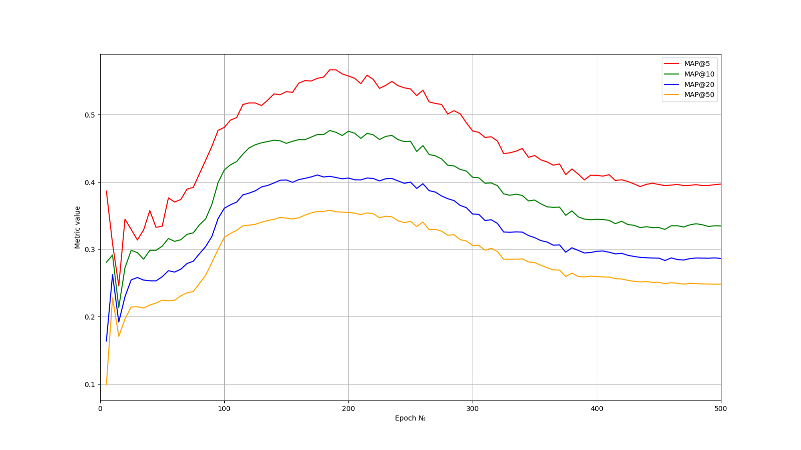

# Final Solution Report

## Introduction

Our task was to create recommender system for [MovieLens 100K dataset](https://grouplens.org/datasets/movielens/100k/).

I decided to create model that instead of working on users and movies ids would provide recommendations based on user's gemographic information (age, gender, occupation, zip code) and favorite movies (10 movies with highest score, that user reviewed).

Also it's worth mentioning that my model won't predict the score that user would give for some film/films, but just try to claim, whether user would watch this film or not. Therefore films with low score might recommended. However I don't think that it's a problem, since user decided to watch that films anyways.

## Data analysis

We have dataset with 100000 reviews, 1682 different movies and 943 users.

Now let's point several useful facts:

- Usually films are rated with 3 or 4 points out of 5
- Users are mostly in their 20-30s
- There are more than twice more male users than female
- Most popular occupation among users - student
- Every user watched and reviewed at least 20 films
- There is user with 737 reviews - almost half of all films
- Mean value for number of reviewed films among users is 106, median - 65
- Most common number of review among users is 20

Having that information I decided to use 10 films with highest score for each user as favorite ones.

## Data preprocessing

So, we need to encode our metadata, I decided to use one-hot encoding for occupations and list of favorite films. Gender is just 0 or 1. Age and zip code are normalized. For zip code I also applied hash function before normalization. As a result there are 1705 values as input for my model.

As for target, I one-hot encoded list of all films that every user watched. So we have 1682 as output size of our model.

I also prepared masks for each input, since it's not good to recommend user its favorite films, that he gave us as input.

## Model Implementation

I decided to create model similar to one that is used in multilabel classification. So every movie is just some class that is need to be predicted.

My model has the following architecture:

```
RecSys(
  (linear_relu_stack): Sequential(
    (0): Linear(in_features=1705, out_features=512, bias=True)
    (1): ReLU()
    (2): Linear(in_features=512, out_features=1024, bias=True)
    (3): ReLU()
    (4): Linear(in_features=1024, out_features=2048, bias=True)
    (5): ReLU()
  )
  (head): Linear(in_features=2048, out_features=1682, bias=True)
)
```

As you can see there are just several linear layers with ReLUs. I also apply sigmoid function on output of my model.

## Model Advantages and Disadvantages

Now let's talk about my model advantages and disadvantages.

Advantages:

- Model is simple in its implementation
- Doesn't require much space
- Fast in training
- Can make prediction for new users
- High flexibility in terms of number of favorite films

Disadvantages:

- Need to be retrained for new films with changes in architecture
- Might suggest films that user may not like

## Training Process

Model was trained locally on Windows 10, Python 3.10 and CUDA 11.8.

Model was trained with Adam optimizer with lr=1e-3 on 500 epochs. I used BCELoss since our problem is similar to multi label classification.

For each epoch I applied mask on both output of model and target values before during loss calculation on validation set. This was done in order to exclude films that user provided as favorite.

There were 500 epochs. I saved model weights every 5 epochs for future evaluation and model selection.

## Evaluation

There are several metrics that might be applied for RecSys. I used [this site](https://towardsdatascience.com/metrics-of-recommender-systems-cde64042127a) as reference. Here I'll explain some of them.

### Precision@K

This is quite similar to normal precision, just that this calculates the precision over the top k items when ordered in the way you want. This way you have the flexibility to vary the K and see how the precision score varies.

$
Precision@K = \cfrac{\text{number of relevant items in top-K}}{K}
$

### Recall@K

Similar to the usual recall metric and very similar to the above Precision@K metric. It has just one small tweak in the formula compared to the one above.

$
Precision@K = \cfrac{\text{number of relevant items in top-K}}{\text{total number of relevant items}}
$

It is useful in cases where there are only a few relevant items and we of course want those at the very front.

### MAP@K

MAP@K or Mean Average Precision @ K is an advanced version of Precision@K. It is good at having a holistic measure of precision instead of basing the metric on just 1 value of K. Let's just look at average precision@K first.

$
AP@K = \cfrac{1}{N} \sum_{i}^{K}(Precision@i)\cdot rel(i)
$

Here, N denotes the total relevant items within top-K items. `rel(i)` is the relevance of an item at the i’th position. For a simple case, it is either 1 (relevant) or 0 (not relevant). MAP@K is just the mean of all the AP@K over all the queries that you may have. It is a better alternative to both the above metrics.

I decided to use MAP@K for evaluation of my model.

## Results

Now let's look on performance of our model.

Firstly, let's check benchmark values for our model, which was trained on different number of epochs. So, in order to calculate it we just need to load checkpoint of model and perform prediction process. 

Note, that for both BCELoss and MAP@K calculation masks should be applied, since we don't want to show films that user provided as favorite one.


Here we can see MAP@K metrics for K=[5, 10, 20, 50]. Metrics for model with lowest BCELoss during validation process are marked with scatter points.

Based on presented results we might came to several conclusions:

- After 200 epochs models tends to over-tune
- Model with lower BSELoss doesn't always imply higher MAP@K metric value
- Model which was trained on 190 epochs has best performance among saved models

Actually, we might calculate MAP@K for each epoch during training process, however I don't think that it's god idea. First of all, it'd significantly slow down training speed. Moreover, I dare to claim that there won't be epochs with significantly better results between evaluated checkpoints. Therefore we can just build this graph and decide by ourself which model we want to estimate on test data.

Now let's check performance of our model on test data within all checkpoints that we stored:



Here we can see that model that were trained on 185 and 190 epochs have best results. However, we decided to use model with 190 train epochs from validation process. So, let's explicitly claim our benchmark results:

```
K=5	    MAP@K: 0.5668253968253968
K=10	MAP@K: 0.4766223649953808
K=20	MAP@K: 0.4085302330159047
K=50	MAP@K: 0.35804317666532703
```

If we'd try to interpret this results, we can say that out of 5 films 2-3 films would interest user. I think that's quite good.
